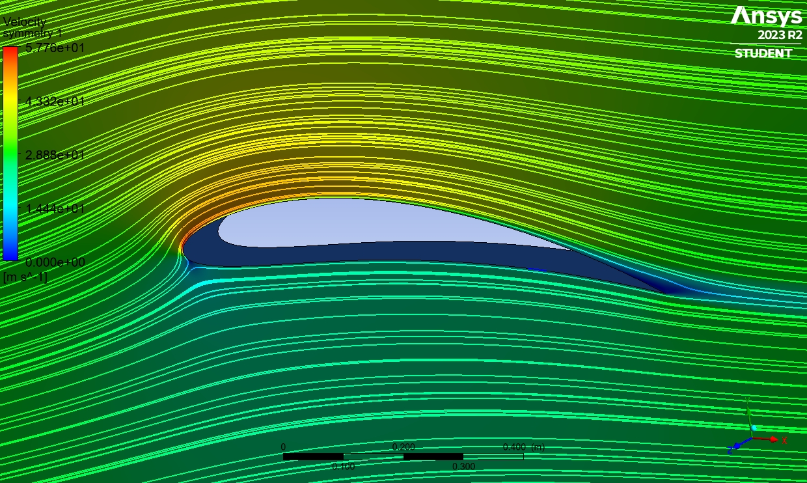
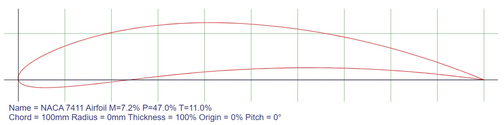
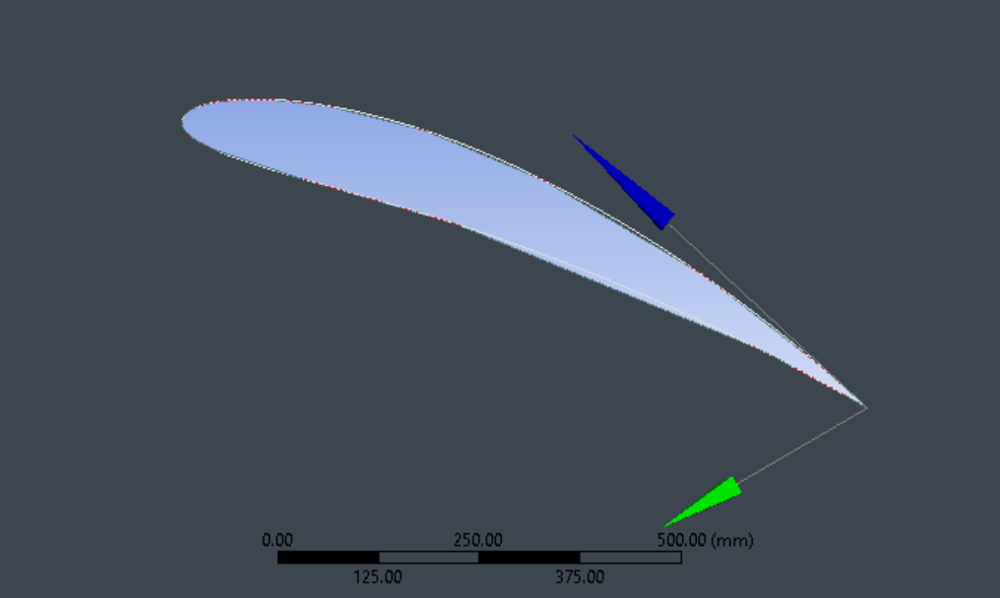
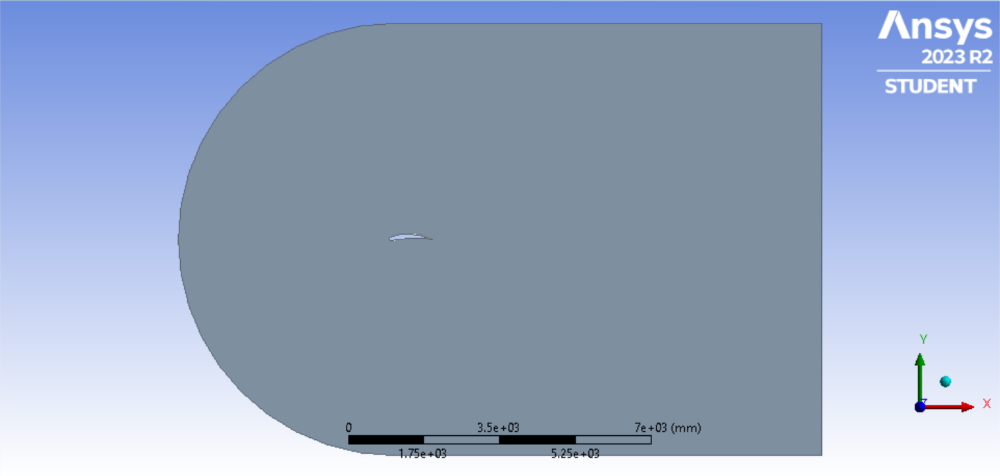
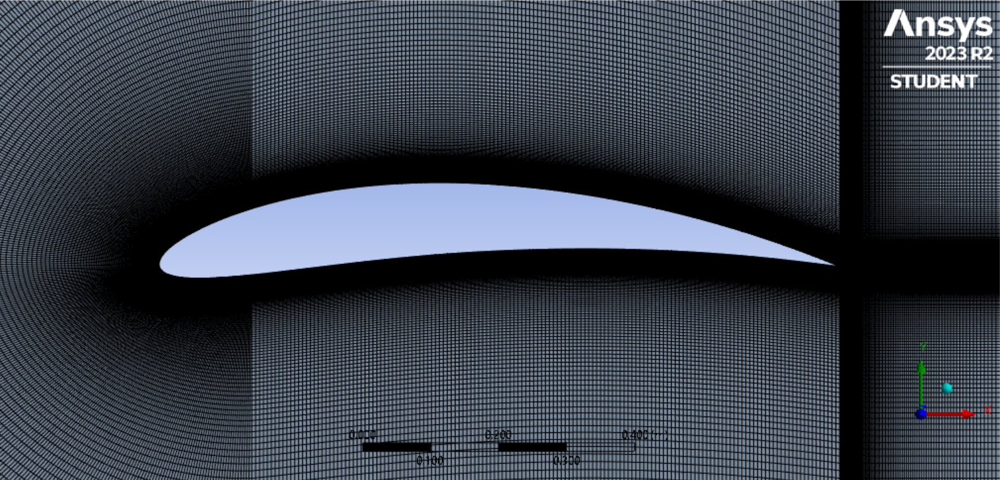
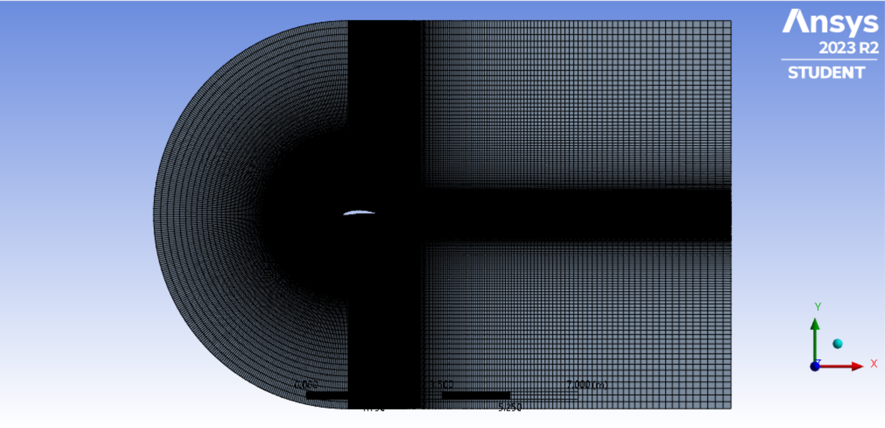

# Glider Assignmnet Report 
 Chaitanya Keshri 

 

## Overview
This report gives a detailed analysis of the NACA 7411 airfoil as generated by the given patamaneters on Roll. No i.e 22B2472. The report contains.
$\alpha$ , $\beta$ , $\gamma$

* Airfoil Creation and Mesh Generation 
* Airfoil Simulation and Results 
* Flow study ( at α = 3 $^{\circ}$ and  10 $^{\circ}$ )
* Conservation Laws ( at $\alpha$  = 3 $^{\circ}$  )
* Airfoil Design Improvements 
* Acknowledgement
* References 

## 1. Airfoil Creation and Meshing
As per my roll number (22B2472) the required wing is a NACA 7411 airfoil which has the following properties 

### Airfoil CAD Model 
| Airfoil CAD | Surroundings |
|---|---|
|  |   |

### Meshing
For creating a good mesh for running the simulations , the CAD model with the fluid and cavity of the airfoil was divided into 6 partitions for studying the flow indidualy in these regions following best practices.

  <figcaption>Mesh structure near airfoil
</figcaption>

 <figcaption >Mesh structure in the fluid region 
</figcaption>

## 2. Airfoil Simulation 

### Cl vs $\alpha$ Plot 

### Cd vs $\alpha$ Plot 

### Cm vs $\alpha$ Plot 

### Cl vs Cd  Plot 

### Lift Curve

### Y-Interceot

### Stall Angle

### Maximum Cl

### Maximum Cl/Cd

## 3. Flow Study 
### At Angle Of Attack ($\alpha$) =  3 $^{\circ}$ 
### Stramline Plots 
### Velocity field magnitude contour plots 
### Pressure field contour plots
### Coefficient of Pressure plots along airfoil surface
### Vorticity field contour plots 
### Approximate location of stagnation and flow separation points in airfoil surface
### Upper surface boundary layer velocity profile at x/c = 10%, 30% and 70% 
### Estimate of boundary layer thickess at the three locations 
### Verify validity of Bernoulli equation along a streamline 
#### (a) far from the boundary layer 
#### (b) inside the boundary layer

### At Angle Of Attack ($\alpha$) =  10 $^{\circ}$ 
### Stramline Plots 
### Velocity field magnitude contour plots 
### Pressure field contour plots
### Coefficient of Pressure plots along airfoil surface
### Vorticity field contour plots 
### Approximate location of stagnation and flow separation points in airfoil surface
### Upper surface boundary layer velocity profile at x/c = 10%, 30% and 70% 
### Estimate of boundary layer thickess at the three locations 
### Verify validity of Bernoulli equation along a streamline 
#### (a) far from the boundary layer 
#### (b) inside the boundary layer

## Conservation Laws ( at $\alpha$ = 3 $^{\circ}$ )
Considering a rectangular control volumne containing the airfoil 

### Net mass flow rate into the control volume
### Net rate of momentum change through the control volume
### Comparison with lift and drag force reported in section 2 of the report

## Airfoil Design 
### Changes
### Simulations 
### Comments 

## Acknowldegemnt 

## Reference 

